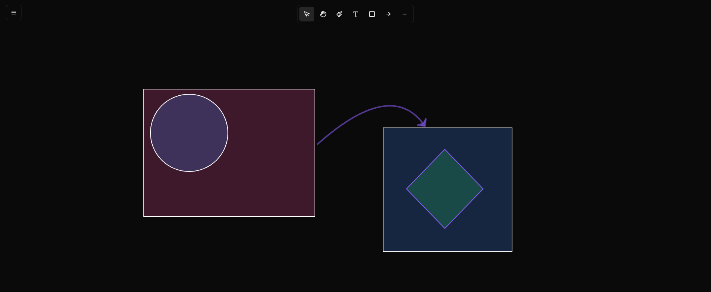

<p align="center">
  <h1 align="center">LineKit</h1>
  <p align="center">A lightweight, open-source canvas drawing application built with TypeScript and HTML5 Canvas.<br/>No frameworks. No runtime dependencies. Just pure web.</p>
</p>

<p align="center">
  
</p>

---

## Features

### Drawing Tools

LineKit ships with **7 tools** accessible from the top toolbar:

| Tool | Description |
|------|-------------|
| **Select** | Select, move, resize and rotate elements. Supports multi-select with Shift+Click and marquee selection. |
| **Move** | Pan the canvas by clicking and dragging. |
| **Draw** | Freehand drawing with customizable stroke width, color and opacity. |
| **Text** | Click to place editable multi-line text blocks with full cursor and selection support. |
| **Shape** | Draw geometric shapes with fill, stroke and border radius options. |
| **Arrow** | Draw straight or curved arrows with auto-sized arrowheads. |
| **Line** | Draw straight or curved lines with a draggable bezier control point. |

### Shapes

8 built-in shape types, each with full customization:

`Rectangle` `Square` `Circle` `Ellipse` `Triangle` `Diamond` `Cylinder` `Pyramid`

- Fill color & opacity
- Stroke color, opacity & width
- Border radius (for rectangles)

---

## Keyboard Shortcuts

### Global

| Shortcut | Action |
|----------|--------|
| `Ctrl + Z` | Undo |
| `Ctrl + Y` / `Ctrl + Shift + Z` | Redo |
| `Ctrl + C` | Copy selected elements |
| `Ctrl + V` | Paste elements |
| `Delete` / `Backspace` | Delete selected elements |
| `Escape` | Switch to Select tool / commit text |
| `Shift + Click` | Add or remove element from selection |

### Text Editing

| Shortcut | Action |
|----------|--------|
| `Ctrl + A` | Select all text |
| `Ctrl + C` / `Ctrl + X` / `Ctrl + V` | Copy / Cut / Paste |
| `Arrow keys` | Move cursor |
| `Shift + Arrow keys` | Extend text selection |
| `Home` / `End` | Jump to line start / end |
| `Shift + Home` / `Shift + End` | Select to line start / end |
| `Enter` | Insert new line |

---

## Getting Started

### Prerequisites

- [Node.js](https://nodejs.org/) v18+

### Install & Run

```bash
git clone https://github.com/your-username/g-draw.git
cd g-draw/client-g-draw
npm install
npm run dev
```

Open [http://localhost:5173](http://localhost:5173) in your browser.

### Build for Production

```bash
npm run build
```

Static files will be output to the `dist/` folder. Serve them with any static file server.

### Preview Production Build

```bash
npm run preview
```

---

## Tech Stack

| | |
|---|---|
| **Language** | TypeScript |
| **Rendering** | HTML5 Canvas 2D API |
| **Build Tool** | Vite |
| **Fonts** | Google Fonts (19 families) |
| **Dependencies** | Zero runtime dependencies |


---

## Roadmap

### 🚀 Upcoming Features

#### Phase 1: Collaboration & Streaming

- [ ] **Live Collaborative Editing** — Multiple users drawing on the same canvas in real-time
- [ ] **WebSocket Integration** — Server-side syncing for collaborative sessions
- [ ] **User Cursors** — See other users' cursors and selections
- [ ] **Frame Management** — Named frames/artboards for organizing designs
- [ ] **Community Frame Editor** — Stream frames to community for collaborative editing


## Community

### Join Us

We're building LineKit as an open-source project with community input.

- **GitHub Issues** — Report bugs or request features
- **Discord Community** *(coming soon)* — Chat with developers and users
- **Live Streams** — Weekly design sessions and collaborative frame editing
- **Contributions** — All skill levels welcome!

### How to Contribute

1. **Report Issues** — Find a bug? Open an issue with a screenshot
2. **Suggest Features** — Have an idea? Discuss it in issues or Discord
3. **Submit Code** — Fork, branch, commit, and open a PR
4. **Documentation** — Improve README, architecture docs, or code comments
5. **Design Help** — Suggest UI/UX improvements

### Getting Started as a Contributor

1. Fork the repository
2. Create your feature branch: `git checkout -b feature/my-feature`
3. Commit your changes: `git commit -m 'Add my feature'`
4. Push to the branch: `git push origin feature/my-feature`
5. Open a Pull Request

Please read [ARCHITECTURE.md](./ARCHITECTURE.md) for an in-depth guide to the codebase.


**Made with ❤️ by the LineKit community**
